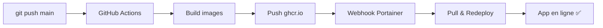

# 🚀 Déploiement Portainer Swarm — Reversal Detection Pro

## Architecture du workflow

```
git push main → GitHub Actions → Build images → Push ghcr.io → Webhook Portainer → Redeploy stack
```

---

## Prérequis

- Cluster Docker Swarm opérationnel avec Portainer (mode Agent)
- Compte GitHub avec accès au repo `fvictoire59va/reversal_pro_v3`
- Portainer accessible sur le cluster

---

## 1. Rendre le repo GitHub accessible (packages ghcr.io)

Les images sont poussées automatiquement sur **GitHub Container Registry (ghcr.io)**.

Le `GITHUB_TOKEN` est automatiquement fourni par GitHub Actions avec la permission `packages: write` — **aucun secret supplémentaire à configurer**.

### Visibilité des packages

Après le premier push, allez dans :
**GitHub → Repo → Packages** → cliquez sur chaque image → **Package settings** → **Danger Zone** → **Change visibility** → `Public`

> Si votre repo est **privé** et que vous voulez garder les images privées, vous devrez configurer un token d'accès dans Portainer (voir étape 3).

---

## 2. Premier build : Pousser les images

```bash
git add .
git commit -m "feat: add Swarm deployment workflow"
git push origin main
```

Allez dans **GitHub → Actions** pour vérifier que le workflow `Build & Deploy` s'exécute.

Trois images seront poussées :
| Image | Description |
|-------|-------------|
| `ghcr.io/fvictoire59va/reversal_pro_v3/backend:latest` | API FastAPI |
| `ghcr.io/fvictoire59va/reversal_pro_v3/frontend:latest` | Nginx + Frontend |
| `ghcr.io/fvictoire59va/reversal_pro_v3/db-init:latest` | Migrations SQL |

---

## 3. Configurer le registry dans Portainer (si images privées)

> **Si les images sont publiques, passez cette étape.**

1. Portainer → **Settings** → **Registries** → **Add registry**
2. Type : **Custom registry**
3. Configuration :
   - Name : `ghcr.io`
   - URL : `ghcr.io`
   - Authentication : ✅
   - Username : `fvictoire59va`
   - Password : un **Personal Access Token (PAT)** GitHub avec le scope `read:packages`
     - Créer sur : https://github.com/settings/tokens → **Generate new token (classic)** → cocher `read:packages`

---

## 4. Créer la Stack dans Portainer

1. **Portainer** → **Stacks** → **Add stack**
2. Choisir **Repository**
3. Configuration :

| Champ | Valeur |
|-------|--------|
| Name | `reversal-pro` |
| Repository URL | `https://github.com/fvictoire59va/reversal_pro_v3` |
| Repository reference | `refs/heads/main` |
| Compose path | `docker-compose.swarm.yml` |
| Authentication | ✅ si repo privé (utiliser PAT GitHub) |
| GitOps updates | ✅ Activer |
| Mechanism | `Webhook` |
| Re-pull image | ✅ Activer (force le pull des nouvelles images latest) |
| Polling interval | `5 minutes` (ou selon préférence) |

4. **Environment variables** — Ajouter les variables depuis `.env.production.example` :

| Variable | Valeur |
|----------|--------|
| `IMAGE_TAG` | `latest` |
| `APP_PORT` | `8080` |
| `POSTGRES_USER` | `reversal` |
| `POSTGRES_PASSWORD` | `votre_mot_de_passe_fort` |
| `POSTGRES_DB` | `reversaldb` |
| `TELEGRAM_ENABLED` | `false` |
| ... | (voir `.env.production.example` pour la liste complète) |

5. Cliquer **Deploy the stack**

---

## 5. Configurer le webhook pour redéploiement automatique

Après la création de la stack :

1. **Portainer** → **Stacks** → `reversal-pro` → **Editor**
2. Copier l'**URL du Webhook** (en bas de la page, section "Webhook")
3. **GitHub** → Repo → **Settings** → **Secrets and variables** → **Actions** → **Variables** (onglet)
4. Cliquer **New repository variable**
   - Name : `PORTAINER_WEBHOOK_URL`
   - Value : l'URL copiée depuis Portainer

Désormais, chaque `git push` sur `main` :
1. Build les images Docker
2. Push sur ghcr.io
3. Déclenche le webhook Portainer
4. Portainer re-pull les images et redéploie le stack

---

## 6. Flux de travail quotidien

### Mettre à jour l'application

```bash
# Modifier le code
git add .
git commit -m "fix: description du changement"
git push origin main
# → Le déploiement se fait automatiquement !
```

### Vérifier le déploiement

- **GitHub Actions** : vérifier que le build est vert
- **Portainer** : vérifier que les services sont en état `Running`
- **Application** : accéder à `http://<IP_SERVEUR>:8080`

### Rollback vers une version précédente

Dans Portainer, modifier la variable `IMAGE_TAG` avec un tag spécifique :
```
IMAGE_TAG=abc1234    # tag du commit sha
IMAGE_TAG=20260211   # tag de la date
```
Puis **Update the stack**.

---

## 7. Structure des fichiers ajoutés

```
.github/
  workflows/
    build-deploy.yml          # GitHub Actions : build + push + webhook
docker-compose.swarm.yml      # Stack Swarm pour Portainer
db/
  Dockerfile                  # Image pour les migrations SQL
  run-migrations.sh           # Script d'exécution des migrations
.env.production.example       # Variables d'environnement de production
```

---

## Résumé du flux


